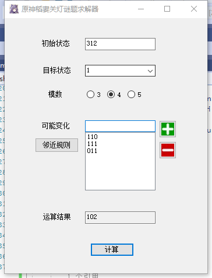

# 原神稻妻关灯谜题求解器

原神稻妻有一类特殊的谜题，用攻击击中其中的某个灯块或者拨动某些方块的朝向就可以引起一些图案变化。这类谜题往往看起来非常简单，但是实际解决起来却比较复杂。因为实际上这是一个经典的“关灯问题”，理论上需要解一个n元一次方程组才能解决。

## 用法

软件界面如图所示。

为了方便起见，程序所有的输入输出都是以整数字符串序列的形式进行，比如三个灯的亮点个数分别为“3，1，2”，则实际需要输入的初始状态为312即可。

“初始状态”指的是，在需要运算的时候，所有块的状态。如果是亮灯，需要规定亮灯个数为一个整数i，输入所有的整数即可。如果是旋转问题等等，则需要规定一个正方向以及一个旋转顺序，把四个方向编号“1,2,3,4”，然后把初始状态输入程序。程序的结果倒是和方向没有什么固定的关系，只需要保证一致就可以。

“**目标状态**”指你希望最终解出的目标是哪个值。如果指定为任意，则程序会在[1,模数]之间找到所需要最少步数的解，同时在解完之后会更新这个值为解得的目标状态。如果指定为某个值，则程序只会以

“**模数**”为一个方块一共可能出现的状态。比如亮灯，每个方块可以亮灯的数量为1，2或3个，那么亮灯问题的模数就是3。如果是旋转问题，模数为方向数，即4 。

“**可能变化**”是一个列表，可以添加、删除值。可能变化的第n行为一个整数字符串序列（如1100），第n行的序列表示，当操作第n个方块之后，所有四个方块的变化方式（加法）。比如原来的状态是133，攻击中间的方块之后，变成了211，则说明攻击中间的方块会让所有方块都+1，则第二行“可能变化”值即为111。如果某个方块不受此影响，则“可能变化”值对它记为0。比如如果133->231，则此行为101。
“可能变化”是一个列表，可以添加、删除值。可能变化的第n行为一个整数字符串序列（如1100），第n行的字符串表示，当操作第n个方块之后，所有四个方块的变化方式（加法）。比如原来的状态是133，攻击中间的方块之后，变成了211，则说明攻击中间的方块会让所有方块都+1，则第二行“可能变化”值即为111，程序运行需要输入所有三行“可能变化”值。如果某个方块不受此影响，则“可能变化”值对它记为0。比如如果133->231，则此行应为101。

“**临近规则**”会生成一个默认的列表。这个列表中包含一个基于临近规则生成的可能变化序列。临近规则就是，当某个方块受到攻击之后，它会让和它相邻的两个方块值都+1。

当填好“初始状态”、“模数”和“可能变化”之后，点击“计算”，就可以输出运算结果。运算结果如果为“2131”，则意为需要打击1方块2下、2方块1下，3方块3下，4方块1下，方可让四个方块同时达到某个相同值，解开谜题。

## 程序

程序使用C#基于.NET Framework 4.7.2开发，理论上可以运行在任何支持本框架的环境中。推荐使用Windows10运行。

程序依赖于MathNet库进行矩阵运算，所以运行时别忘记把Release里签名后的MathNet.Numerics.dll和程序放在同一个文件夹下。

## 鸣谢

感谢NGA老哥提供了解题思路。
